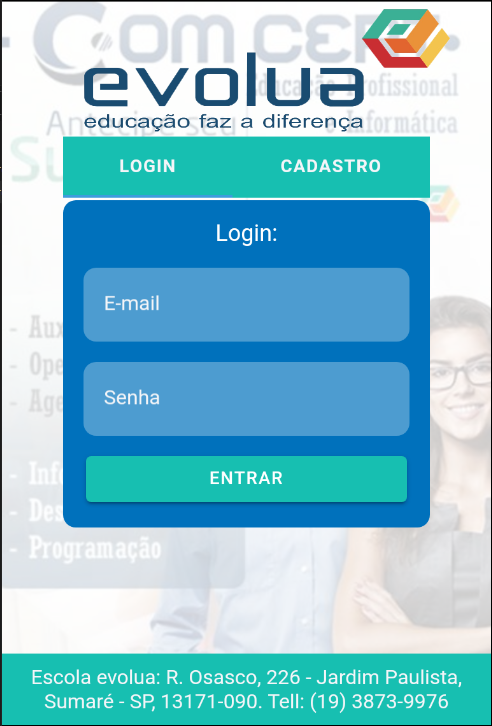
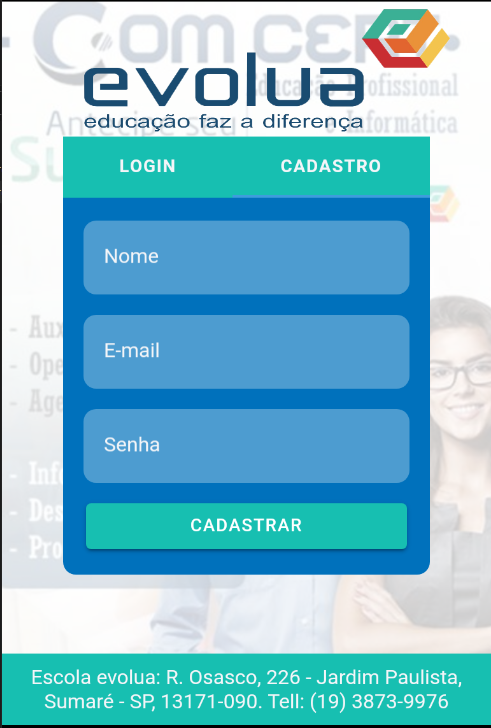
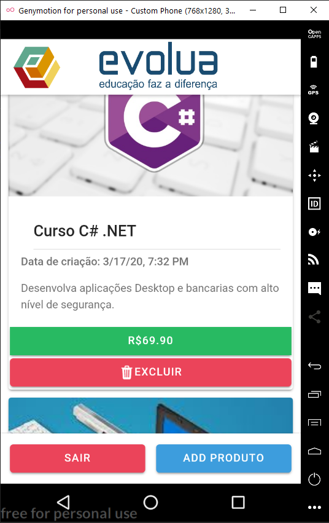
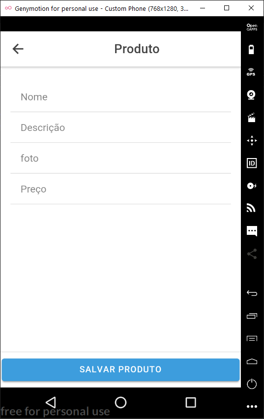

<h1>Aplicativo desenvolvido como projeto de conclusão de curso.</h1>

Aplicativo Mobile Android, sobre venda de Cursos feito a patir do Ionic 4 com CRUD no Firebase. Este aplicativo foi um projeto desenvolvido como conclusão do curso Angular/Ionic/Cordova na escola Evolua.

<h1>Adicione as Depências</h1>

Basta dar um <code>npm i</code> para instalar todas as depêndencias.

<h1>Página de Login do App:</h1>

<h1>Página de Cadastro do App:</h1>

<h1>Página Home do App:</h1>

<h1>Página para editar os Produtos no Database do App:</h1>

<h1>Para gerar o .apk do projeto</h1>

Digite <code>ionic cordova build --release android</code> espere um pouco e será gerado um arquivo.apk com o PATH que o terminal informar.

